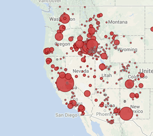
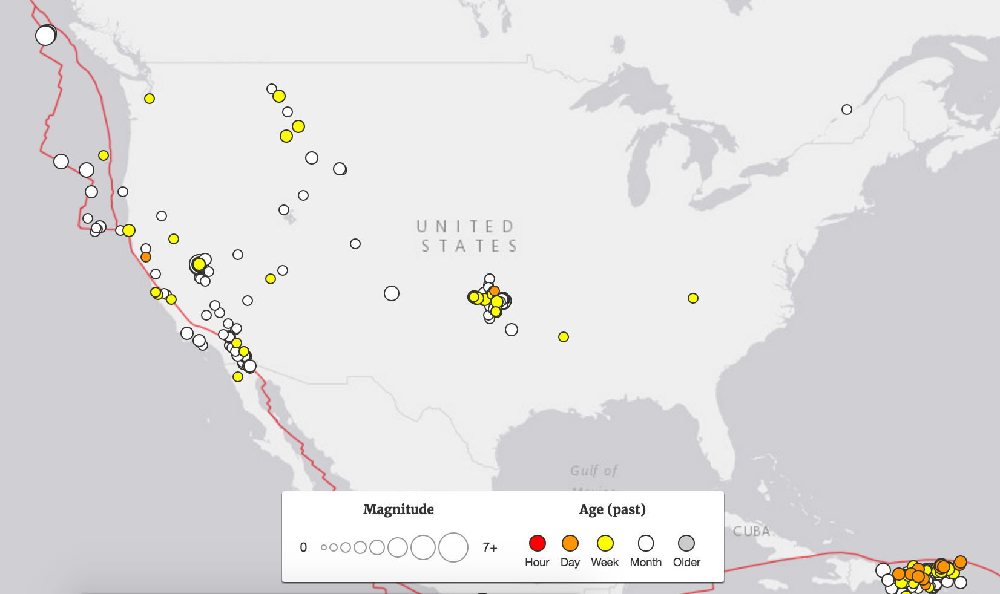

```{r packages, include=FALSE}
library(sf)
library(ggplot2)
library(dplyr)
library(tidyr)
```

```{r config, include=FALSE}
knitr::opts_chunk$set(
  fig.width=7,
  fig.height=5,
  out.width="\\textwidth",
  fig.align="center",
  echo=FALSE,
  warning=FALSE
)

theme_set(theme_bw())
```


# Spatio-temporal data


## Time Series Data - Discrete
    
```{r message=FALSE}
x = quantmod::getSymbols("^GSPC", src = "yahoo", from = as.Date("2018-01-01"), auto.assign = FALSE)

plot(x[,"GSPC.Open"], main='S&P 500 Open (^GSPC)', type='b', pch=16, col="black")
```

## Time Series Data - Continuous
  
```{r}
load("data/frn_example.Rdata")

pm25 = pm25 %>% 
  transmute(date = lubridate::mdy(Date), pm25 = PM25) %>%
  filter(lubridate::month(date) %in% 1:12)

ggplot(pm25, aes(x=date, y=pm25)) +
  geom_point() +
  geom_line() +
  labs(
    title="FRN Measured PM25",
    ylab="PM25 (ug/m^3)"
  )
```


## Spatial Data - Areal
    
```{r out.width="0.8\\textwidth"}
nc = st_read(system.file("shape/nc.shp", package="sf"), quiet = TRUE) %>%
  select(starts_with("SID")) %>%
  gather(var,value, -geometry)

ggplot(nc, aes(fill=value)) +
  geom_sf() +
  coord_sf(datum = NA) +
  facet_grid(var~.) +
  scale_fill_viridis_c()
```

## Spatial Data - Point referenced
    
```{r}
data(meuse, package = "sp")
m = st_as_sf(meuse, coords=c("x","y")) %>% 
  select(2:4) %>%
  mutate_if(is.numeric, function(x) x / max(x)) %>%
  gather(metal, value, -geometry)

data(meuse.riv, package = "sp")
mr = st_polygon(list(meuse.riv)) %>% st_sfc() %>% st_sf()

ggplot(m, aes(color=value)) +
  geom_sf(data=mr, color=NA, fill="lightblue", alpha=0.5) +
  geom_sf() +
  coord_sf(datum = NA) +
  facet_wrap(~metal) + 
  theme_bw() +
  ylim(328000,334000) +
  scale_colour_viridis_c() +
  #scale_color_distiller(palette = "Spectral") +
  labs(title="Meuse River", color="% of max")
```

## Point Pattern Data - Time
   
```{r}
old_faithful = MASS::geyser %>% 
  mutate(time = cumsum(waiting)+cumsum(lag(duration,default=0))) %>% 
  select(time, duration) %>% 
  slice(1:25)

plot(old_faithful, type='p', main="Old Faithful Eruption Duration", pch=16)
```


## Point Pattern Data - Space
    
```{r out.width="0.8\\textwidth"}

```


## Point Pattern Data - Space + Time
        
```{r out.width="0.8\\textwidth"}

```


# (Bayesian) Linear Models

## Linear Models {.t}

Pretty much everything we a going to see in this course will fall under the umbrella of linear or generalized linear models. 

$$ 
\begin{aligned}
Y_i &= \beta_0 + \beta_1 \, x_{i1} + \cdots + \beta_p \, x_{ip} + \epsilon_i  \\
\epsilon_i &\sim N(0, \sigma^2)
\end{aligned}
$$
which we can also express using matrix notation as 

$$
\begin{aligned}
\underset{n \times 1}{\symbf{Y}} &= \underset{n \times p}{\symbf{X}} \, \underset{p \times 1}{\symbf{\beta}} + \underset{n \times 1}{\symbf{\epsilon}} \\
\symbf{\epsilon} &\sim N(\underset{n \times 1}{\symbf{0}}, \; \sigma^2 \underset{n \times n}{\mathbb{1}_n})
\end{aligned}
$$


## Multivariate Normal Distribution {.t}

For an $n$-dimension multivate normal distribution with covariance $\symbf{\Sigma}$ (positive semidefinite) can be written as

$$
\underset{n \times 1}{\symbf{Y}} \sim N(\underset{n \times 1}{\symbf{\mu}}, \; \underset{n \times n}{\symbf{\Sigma}}) \text{ where } \{\symbf{\Sigma}\}_{ij} = \rho_{ij} \sigma_i \sigma_j
$$

$$
\begin{pmatrix}
Y_1\\ \vdots\\ Y_n
\end{pmatrix}
\sim N\left(
\begin{pmatrix}
\mu_1\\ \vdots\\ \mu_n
\end{pmatrix}, \,
\begin{pmatrix}
\rho_{11}\sigma_1\sigma_1 & \cdots & \rho_{1n}\sigma_1\sigma_n \\
\vdots & \ddots & \vdots \\
\rho_{n1}\sigma_n\sigma_1 & \cdots & \rho_{nn}\sigma_n\sigma_n \\
\end{pmatrix}
\right)
$$


## Multivariate Normal Distribution - Density {.t}

For the $n$ dimensional multivate normal given on the last slide, its density is given by

$$
(2\pi)^{-n/2} \; \det(\symbf{\Sigma})^{-1/2} \; \exp{\left(-\frac{1}{2} \underset{1 \times n}{(\symbf{Y}-\symbf{\mu})'} \underset{n \times n}{\symbf{\Sigma}^{-1}} \underset{n \times 1}{(\symbf{Y}-\symbf{\mu})}\right)} 
$$

and its log density is given by

$$
-\frac{n}{2} \log 2\pi - \frac{1}{2} \log \det(\symbf{\Sigma}) - \frac{1}{2} \underset{1 \times n}{(\symbf{Y}-\symbf{\mu})'} \underset{n \times n}{\symbf{\Sigma}^{-1}} \underset{n \times 1}{(\symbf{Y}-\symbf{\mu})}
$$


## Maximum Likelihood - $\symbf{\beta}$


## Maximum Likelihood - $\sigma^2$


## Bayesian Model {.t}

Likelihood:

$$
\symbf{Y} \,|\, \symbf{\beta}, \, \sigma^2 \sim N(\symbf{X}\symbf{\beta},\, \sigma^2 \, {\mathbb{1}_n})
$$

. . .

Priors:
$$
\beta_i \sim N(0, \sigma^2_\beta)
\text{  or  } 
\symbf{\beta} \sim N(\symbf{0}, \sigma^2_\beta \, {\mathbb{1}_p})
$$

$$
\sigma^2 \sim \text{Inv-Gamma}(a,\,b)
$$

## Deriving the posterior {.t}

\footnotesize

$$ 
\begin{aligned}
\left[ \symbf{\beta}, \sigma^2 \,|\, \symbf{Y}, \symbf{X} \right] 
  &= \frac{[\symbf{Y} \,|\, \symbf{X}, \symbf{\beta}, \sigma^2]}{[\symbf{Y} \,|\, \symbf{X}]} [\symbf{\beta}, \sigma^2] \\
  &\propto [\symbf{Y} \,|\, \symbf{X}, \symbf{\beta}, \sigma^2] [\symbf{\beta},\,\sigma^2] \\
  &\propto [\symbf{Y} \,|\, \symbf{X}, \symbf{\beta}, \sigma^2] [\symbf{\beta}\,|\,\sigma^2] [\sigma^2]
\end{aligned}
$$

. . . 

where, 

$$ 
f(\symbf{Y} \,|\, \symbf{X}, \symbf{\beta}, \sigma^2) = 
\left(2\pi \sigma^2\right)^{-n/2} \exp\left( -\frac{1}{2\sigma^2} (\symbf{Y}-\symbf{X}\symbf{\beta})'(\symbf{Y}-\symbf{X}\symbf{\beta}) \right) 
$$

. . .

$$ 
f(\symbf{\beta}\,|\, \sigma^2_\beta) = (2\pi \sigma^2_\beta)^{-p/2} \exp\left( -\frac{1}{2\sigma^2_\beta} \symbf{\beta}'\symbf{\beta} \right) 
$$

. . .

$$
f(\sigma^2 \,|\, a,\, b) = \frac{b^a}{\Gamma(a)} (\sigma^2)^{-a-1} \exp\left( -\frac{b}{\sigma^2} \right) 
$$


## Deriving the Gibbs sampler ($\sigma^2$ step) {.t}

\scriptsize
$$
\begin{aligned}
\left[ \symbf{\beta}, \sigma^2 \,|\, \symbf{Y}, \symbf{X}  \right]  \propto
  &\left(2\pi \sigma^2\right)^{-n/2} \exp\left( -\frac{1}{2\sigma^2} (\symbf{Y}-\symbf{X}\symbf{\beta})'(\symbf{Y}-\symbf{X}\symbf{\beta}) \right) \\
  &(2\pi \sigma^2_\beta)^{-p/2} \exp\left( -\frac{1}{2\sigma^2_\beta} \symbf{\beta}'\symbf{\beta} \right) \\
  &\frac{b^a}{\Gamma(a)} (\sigma^2)^{-a-1} \exp\left( -\frac{b}{\sigma^2} \right) 
\end{aligned}
$$

## {.plain}


## Deriving the Gibbs sampler ($\symbf{\beta}$ step) {.t}

\scriptsize
$$
\begin{aligned}
\left[ \symbf{\beta}, \sigma^2 \,|\, \symbf{Y}, \symbf{X}  \right]  \propto
  &\left(2\pi \sigma^2\right)^{-n/2} \exp\left( -\frac{1}{2\sigma^2} (\symbf{Y}-\symbf{X}\symbf{\beta})'(\symbf{Y}-\symbf{X}\symbf{\beta}) \right) \\
  &(2\pi \sigma^2_\beta)^{-p/2} \exp\left( -\frac{1}{2\sigma^2_\beta} \symbf{\beta}'\symbf{\beta} \right) \\
  &\frac{b^a}{\Gamma(a)} (\sigma^2)^{-a-1} \exp\left( -\frac{b}{\sigma^2} \right) 
\end{aligned}
$$

## {.plain}


# A Quick Example

## Some Fake Data {.t}

Lets generate some simulated data where the underlying model is known and see how various regression preceedures function.

$$ \beta_0 = 0.7, \quad \beta_1 = 1.5, \quad \beta_2 = -2.2, \quad \beta_3 = 0.1 $$
$$ n=100, \quad \epsilon_i \sim N(0,1) $$


## Generating the data {.t}

```{r echo=TRUE}
set.seed(01162018)
n = 100
beta = c(0.7,1.5,-2.2,0.1)
eps = rnorm(n)

d = data_frame(
  X1 = rt(n,df=5),
  X2 = rt(n,df=5),
  X3 = rt(n,df=5)
) %>%
  mutate(Y = beta[1] + beta[2]*X1 + beta[3]*X2 + beta[4]*X3 + eps)

X = cbind(1, d$X1, d$X2, d$X3)
```


## Least squares fit {.t}

Let $\hat{\symbf{Y}}$ be our estimate for $\symbf{Y}$ based on our estimate of $\symbf{\beta}$,
$$ \hat{\symbf{Y}} = \hat{\beta}_0 + \hat{\beta}_1 \, \symbf{X}_{1} + \hat{\beta}_2 \, \symbf{X}_{2} + \hat{\beta}_3 \, \symbf{X}_{3} = \symbf{X}\, \hat{\symbf{\beta}} $$

. . .

The least squares estimate, $\hat{\symbf{\beta}}_{ls}$, is given by
$$ \underset{\symbf{\beta}}{\argmin} \sum_{i=1}^n \left( Y_i - \symbf{X}_{i\cdot} \symbf{\beta} \right)^2 $$

. . .

Previously we derived,
$$ \hat{\symbf{\beta}}_{ls} = (\symbf{X}' \symbf{X})^{-1} \symbf{X}' \, \symbf{Y} $$

## Frequentist Fit {.t}

```{r echo=TRUE}
l = lm(Y ~ X1 + X2 + X3, data=d)
l$coefficients

(beta_hat = solve(t(X) %*% X, t(X)) %*% d$Y)
```


## Bayesian model specification (JAGS) {.t}

```{r echo=TRUE}
model = 
"model{
  # Likelihood
  for(i in 1:length(Y)){
    Y[i]   ~ dnorm(mu[i], tau)
    mu[i] = beta[1] + beta[2]*X1[i] + beta[3]*X2[i] + beta[4]*X3[i]
  }

  # Prior for beta
  for(j in 1:4){
    beta[j] ~ dnorm(0,1/100)
  }

  # Prior for sigma / tau2
  tau ~ dgamma(1, 1)
  sigma2 = 1/tau
}"
```

## Bayesian model fitting (JAGS) {.t}

\scriptsize
```{r echo=TRUE, message=FALSE}
m = rjags::jags.model(
  textConnection(model), 
  data = d
) 

update(m, n.iter=1000, progress.bar="none")

samp = rjags::coda.samples(
  m, variable.names=c("beta","sigma2"), 
  n.iter=5000, progress.bar="none"
)
```


## Results {.t}

```{r}
other = 
  bind_rows(
    data_frame(
      param = paste0("beta[",1:4,"]"),
      class = "beta",
      value = beta,
      type = "truth"
    ) %>%
    rbind(list("sigma2","sigma2",1, "truth")),
    data_frame(
      param = paste0("beta[",1:4,"]"),
      class = "beta",
      value = l$coefficients,
      type = "mle"
    ) %>%
    rbind(list("sigma2", "sigma2", var(l$residuals), "mle"))
  )

samp %>% 
  purrr::pluck(1) %>%
  as.data.frame() %>%
  tidyr::gather(param, value) %>%
  mutate(class = stringr::str_replace(param, "\\[\\d+\\]","")) %>%
  ggplot(aes_string(x="value", fill="class")) +
    geom_density(alpha=0.5) +
    facet_grid(param~.) +
    geom_vline(data = other, aes_string(xintercept="value", color="type", linetype="type"), size=0.8) +
    scale_colour_manual(values=c("grey22","grey52")) +
    guides(fill=FALSE)
```

## Results (zoom) {.t}

```{r}
samp %>% 
  purrr::pluck(1) %>%
  as.data.frame() %>%
  tidyr::gather(param, value) %>%
  mutate(class = stringr::str_replace(param, "\\[\\d+\\]","")) %>%
  ggplot(aes_string(x="value", fill="class")) +
    geom_density(alpha=0.5) +
    facet_wrap(~param, scales = "free") +
    geom_vline(data = other, aes_string(xintercept="value", color="type", linetype="type"), size=0.8) +
    scale_colour_manual(values=c("grey22","grey52")) +
    guides(fill=FALSE)
```

