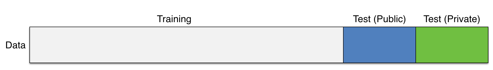
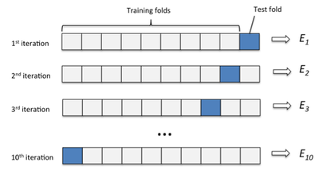

```{r setup, include=FALSE}
library(dplyr)
library(ggplot2)
```

```{r config, include=FALSE}
knitr::opts_chunk$set(
  collapse = TRUE,
  fig.width=7,
  fig.height=3.8,
  out.width="\\textwidth",
  fig.align="center",
  echo=TRUE,
  warning=FALSE
)

ggplot2::theme_set(ggplot2::theme_bw())
```


# Some more linear models

## Linear model and data {.t}

\scriptoutput

```{r echo=FALSE}
set.seed(01232018)
n = 100

d = data_frame(
  x = 1:n,
  y = arima.sim(n=100, list(ar=0.9,sq=1)) %>% as.numeric() + x * 0.07
)
```

```{r echo=TRUE, fig.height=4}
ggplot(d, aes(x=x,y=y)) + 
  geom_line() + 
  geom_smooth(method="lm", color="blue", se = FALSE)
```

## Linear model

```{r}
l = lm(y ~ x, data=d)

summary(l)
```


## Bayesian model specification (JAGS) {.t}

```{r echo=TRUE}
model = 
"model{
  # Likelihood
  for(i in 1:length(y)){
    y[i] ~ dnorm(mu[i], tau)
    mu[i] = beta[1] + beta[2]*x[i]
  }

  # Prior for beta
  for(j in 1:2){
    beta[j] ~ dnorm(0,1/100)
  }

  # Prior for sigma / tau2
  tau ~ dgamma(1, 1)
  sigma2 = 1/tau
}"
```


## Bayesian model fitting (JAGS) {.t}

\scriptoutput

```{r echo=TRUE, message=FALSE}
n_burn = 1000; n_iter = 5000

m = rjags::jags.model(
  textConnection(model), data=d, 
  quiet=TRUE, n.chains = 4
) 
update(m, n.iter=n_burn, progress.bar="none")
samp = rjags::coda.samples(
  m, variable.names=c("beta","sigma2"), 
  n.iter=n_iter, progress.bar="none"
)

str(samp, max.level=1)
```

## \texttt{coda} {.t}

```{r}
plot(samp)
```

## \texttt{tidybayes} {.t}

\scriptoutput

```{r echo=TRUE}
df_mcmc = tidybayes::gather_samples(samp, beta[i], sigma2) %>%
  mutate(parameter = paste0(term, ifelse(is.na(i),"",paste0("[",i,"]")))) %>%
  group_by(parameter, .chain)

head(df_mcmc)

tail(df_mcmc)
```


## Posterior plots {.t}

\scriptoutput

```{r echo=TRUE, fig.height=4}
ggplot(df_mcmc,aes(fill=as.factor(.chain), group=.chain, x=estimate)) +
  geom_density(alpha=0.5, color=NA) +
  facet_wrap(~ parameter,scales = "free")
```

## Trace plots {.t}

\scriptsize

```{r echo=TRUE, fig.height=3.8} 
df_mcmc %>% filter(.iteration <= 500) %>%
ggplot(aes(x=.iteration, y=estimate, color=as.factor(.chain))) +
  geom_line(alpha=0.5) +
  facet_grid(parameter~.chain, scale="free_y") +
  geom_smooth(method="loess") + labs(color="chain")
```


## Credible Intervals {.t}

\scriptoutput

```{r echo=TRUE}
df_ci = tidybayes::mean_hdi(df_mcmc, estimate, .prob=c(0.8, 0.95))

df_ci
```

## Aside - `mean_qi` vs `mean_hdi`

These differ in the use of the quantile interval vs. the highest-density interval.

. . .

```{r echo=FALSE}
ci_ex = data_frame(
  dist_1 = rnorm(10000),
  dist_2 = c(rnorm(5000, 2), rnorm(5000, -2)),
  dist_3 = abs(rt(10000, df = 8))
) %>% 
  mutate_all(function(x) (x-min(x))/max(x) ) %>%
  tidyr::gather(dist, x) 

tmp = rbind(
  ci_ex %>% group_by(dist) %>% tidybayes::mean_hdi(x, .prob=c(0.5,0.95)) %>% mutate(method="hpd"),
  ci_ex %>% group_by(dist) %>% tidybayes::mean_qi( x, .prob=c(0.5,0.95)) %>% mutate(method="qi")
) %>%
  group_by(method,dist,.prob) %>%
  mutate(region = 1:n()) %>%
  tidyr::gather(type, bound, conf.low, conf.high)

  ggplot(tmp, aes(x=x)) +
    geom_density(data=ci_ex, aes(group=dist), fill="grey", color="black") + 
    geom_ribbon(data=filter(tmp, .prob==0.95), aes(group=region, x=bound), ymin=0, ymax=5, fill="blue", alpha=0.2) +
    geom_ribbon(data=filter(tmp, .prob==0.5), aes(group=region, x=bound), ymin=0, ymax=5, fill="red", alpha=0.2) +
    geom_vline(aes(color=as.factor(.prob), xintercept=bound)) +
    facet_grid(method~dist) +
    ylim(0,4.75) +
    labs(color="prob")
```

## Caterpillar Plots {.t}

\scriptoutput

```{r echo=TRUE, fig.height=4}
df_ci %>%
  ggplot(aes(x=estimate, y=.chain, color=as.factor(.chain))) + 
  facet_grid(parameter~.) +
  tidybayes::geom_pointintervalh() +
  ylim(0.5,4.5)
```


# Prediction

## Revised model {.t}

```{r echo=TRUE}
model_pred = 
"model{
  # Likelihood
  for(i in 1:length(y)){
    mu[i] = beta[1] + beta[2]*x[i]
    y[i] ~ dnorm(mu[i], tau)
    y_pred[i] ~ dnorm(mu[i], tau)
  }

  # Prior for beta
  for(j in 1:2){
    beta[j] ~ dnorm(0,1/100)
  }

  # Prior for sigma / tau2
  tau ~ dgamma(1, 1)
  sigma2 = 1/tau
}"
```

## Revised fitting {.t}

```{r echo=TRUE}
n_burn = 1000; n_iter = 5000

m = rjags::jags.model(
  textConnection(model_pred), data=d, 
  quiet=TRUE, n.chains = 1
) 

update(m, n.iter=n_burn, progress.bar="none")

pred = rjags::coda.samples(
  m, variable.names=c("beta","sigma2","mu","y_pred","y","x"), 
  n.iter=n_iter, progress.bar="none"
)
```

## Predictions {.t}

\scriptoutput

```{r echo=TRUE}
df_pred = tidybayes::spread_samples(pred, y_pred[i], y[i], x[i], mu[i]) %>%
  mutate(resid = y - mu)

df_pred
```

## $\mu$ vs $y_{pred} {.t}

```{r}
df_pred %>% ungroup() %>% filter(i %in% c(1,50,100)) %>% select(i, mu, y_pred) %>% tidyr::gather(param, val, -i) %>%
  ggplot(aes(x=val, fill=param)) + geom_density(alpha=0.5) + facet_wrap(~i)
```


## Predictions

```{r echo=TRUE, fig.height=4}
df_pred %>% ungroup() %>% filter(.iteration <= 200) %>%
ggplot(aes(x=x)) + 
  geom_line(aes(y=mu, group=.iteration), color="blue", alpha=0.1) +
  geom_point(data=d, aes(y=y))
```


## Posterior distribution ($\mu$) {.t}

```{r echo=TRUE, fig.height=4}
df_pred %>% ungroup() %>%
ggplot(aes(x=x)) + 
  tidybayes::stat_lineribbon(aes(y=mu), alpha=0.5) +
  geom_point(data=d, aes(y=y))
```

## Posterior predictive distribution ($y_{pred}$) {.t}

```{r echo=TRUE, fig.height=4}
df_pred %>% ungroup() %>%
ggplot(aes(x=x)) + 
  tidybayes::stat_lineribbon(aes(y=y_pred), alpha=0.5) +
  geom_point(data=d, aes(y=y))
```


  
## Residual plot {.t}

```{r echo=TRUE, fig.height=4}
df_pred %>% ungroup() %>%
  ggplot(aes(x=x, y=resid)) + 
  geom_boxplot(aes(group=x), outlier.alpha = 0.2)
```


# Model Evaluation

## Model assessment? {.t}

If we think back to our first regression class, one common option is $R^2$ which gives us the variability in $Y$ explained by our model.

Quick review:
  
. . . 

$$ 
\underset{\text{Total}}{\sum_{i=1}^n \left(Y_i - \bar{Y}\right)^2} = \underset{\text{Model}}{\sum_{i=1}^n \left(\hat{Y}_i - \bar{Y}\right)^2} + \underset{\text{Error }}{\sum_{i=1}^n \left(Y_i - \hat{Y}_i\right)^2} $$
  
. . .

$$
R^2 
  = \frac{\sum_{i=1}^n \left(\hat{Y}_i - \bar{Y}\right)^2}{\sum_{i=1}^n \left(Y_i - \bar{Y}\right)^2}
  = \text{Cor}(\symbf{Y}, \hat{\symbf{Y}})^2 
  = \frac{\text{Var}(\hat{\symbf{Y}}) }{ \text{Var}({\symbf{Y}}) }
$$
  
  
## Bayesian $R^2$ {.t}
  
When we compute any statistic for our model we want to do so at each iteration so that we can obtain the posterior distribution of that particular statistic (e.g. the posterior distribution of $R^2$ in this case).

```{r}
df_R2 = df_pred %>%
  group_by(.iteration) %>%
  summarize(
    R2_classic = var(mu) / var(y),
    R2_bayes   = var(mu) / (var(mu) + var(resid))
  )

df_R2
```

## Uh oh ... {.t}

```{r}
df_R2 %>% 
  tidyr::gather(method, R2, -.iteration) %>%
  ggplot(aes(x=R2, fill=method)) + 
    geom_density(alpha=0.5) +
    geom_vline(xintercept=summary(l)$r.squared, size=1)
```

## What if we collapsed first? {.t}

```{r echo=TRUE}
df_pred %>%
  group_by(i) %>%
  summarize(mu = mean(mu), y=mean(y), resid=mean(resid)) %>%
  summarize(
    R2_classic = var(mu) / var(y),
    R2_bayes   = var(mu) / (var(mu) + var(resid))
  )
  
summary(l)$r.squared
```


## Some problems with $R^2$ {.t}

Some new issues,

* $R^2$ doesn't really make sense in the Bayesian context

  * multiple possible definitions with different properties
  * fundamental equality doesn't hold anymore
  
. . .


Some old issues,

* $R^2$ always increases (or stays the same) when a predictor is added

* $R^2$ is highly susceptible to over fitting

* $R^2$ is sensitive to outliers

* $R^2$ depends heavily on current values of $Y$

* $R^2$ can differ drastically for two equivalent models (i.e. nearly identical inferences about key parameters)


# Some Other Metrics

## Root Mean Square Error {.t}

The traditional definition of rmse  is as follows

$$ \text{RMSE} = \sqrt{ \frac{1}{n} \sum_{i=1}^n \left(Y_i - \hat{Y_i} \right)^2 } $$

. . .

In the bayesian context, we have posterior samples from each parameter / prediction of interest so we can express this as

$$ \text{RMSE} = \sqrt{  \frac{1}{m} \frac{1}{n} \sum_{s=1}^{m} \sum_{i=1}^n \left(Y_i - {\hat{Y}}^s_{i} \right)^2 } $$


## Continuous Rank Probability Score {.t}

Another approach is the continuous rank probability score which comes from the probabilistic forecasting literature, it compares the full posterior predictive distribution to the observation / truth.

$$ \text{CRPS} = \int_{-\infty}^\infty \left(F_{\hat{Y}}(z) - {1}_{z \geq Y}\right)^2 dz $$

where $F_{\hat{Y}}$ is thes CDF of $\hat{Y}$ (the posterior predictive distribution for $Y$) and ${1}_{z \geq Y}$ is the indicator function which equals 1 when $z \geq Y$, the true/observed value of $Y$.

## CDF vs Indicator

```{r echo=FALSE, warning=FALSE}
d_crps_ex = data_frame(
  value = rt(10000, df=2)
)

indicator = data.frame(value=seq(-12,12,len=1000)) %>% mutate(y = as.double(value >= 0))

ggplot(d_crps_ex, aes(x=value)) +
  geom_line(data=indicator, color="black", aes(y=y), size=1, alpha=0.5) +
  stat_ecdf(size=1, alpha=0.5, color="blue") +
  xlim(-10,10)
```


## Empirical CDF vs Indicator

```{r echo=FALSE, warning=FALSE}
d_crps_ex = data_frame(
  value = rt(10, df=2)
)

indicator = data.frame(value=seq(-12,12,len=1000)) %>% mutate(y = as.double(value >= 0))

ggplot(d_crps_ex, aes(x=value)) +
  geom_line(data=indicator, color="black", aes(y=y), size=1, alpha=0.5) +
  stat_ecdf(size=1, alpha=0.5, color="blue") +
  xlim(-5,5)
```


## Accuracy vs. Precision - RMSE

```{r echo=FALSE, message=FALSE, warning=FALSE}
d_crps = data_frame(
dist1 = rnorm(10000, sd=2)+0,
dist2 = rnorm(10000, sd=2)+2,
dist3 = rnorm(10000, sd=1)+0,
dist4 = rnorm(10000, sd=1)+2
) %>% tidyr::gather(dist)

rmses = d_crps %>% group_by(dist) %>% summarise(rmse = (value-0)^2 %>% mean() %>% sqrt() %>% round(3))

rmse_lookup = rmses$rmse %>% setNames(rmses$dist)
rmse_labeler = function(variable, value)
  paste0(value, " (rmse = ", rmse_lookup[value],")")

ggplot(d_crps, aes(value, color=dist, fill=dist)) +
  geom_density(alpha=0.1) +
  facet_grid(~dist, labeller = rmse_labeler) + 
  geom_vline(xintercept=0)
```

## Accuracy vs. Precision - CRPS

```{r echo=FALSE, warning=FALSE}

source("util/util-crps.R")

crps = d_crps %>% group_by(dist) %>% summarise(crps = calc_crps(value, 0))

crps_lookup = crps$crps %>% setNames(crps$dist) %>% round(3)
crps_labeler = function(variable, value)
  paste0(value, " (crps = ", crps_lookup[value],")")

indicator = data.frame(value=seq(-10,10,len=1000)) %>% mutate(y = as.double(value >= 0))

ggplot(d_crps, aes(value, color=dist)) +
  geom_line(data=indicator, color="black", aes(y=y), size=1, alpha=0.5) +
  stat_ecdf(size=1, alpha=0.5) +
  facet_grid(~dist, labeller = crps_labeler)
```


## Empirical Coverage

One final method, which assesses model calibration is to examine how well credible intervals, derived from the posterior predictive distributions of the $Y$s, capture the true/observed values.

. . . 


\scriptoutput

```{r}
df_ec = df_pred %>% 
  group_by(x,y) %>% 
  tidybayes::mean_hdi(y_pred, .prob = c(0.5,0.8,0.9,0.95))

df_ec
```

## Calculating Empirical Coverage {.t}

```{r}
df_ec %>% 
  mutate(contains = y >= conf.low & y <= conf.high) %>%
  group_by(prob=.prob) %>%
  summarize(emp_cov = sum(contains)/n())
```

## Posterior predictive distribution ($y_{pred}$) {.t}

```{r echo=TRUE, fig.height=4}
df_pred %>% ungroup() %>%
ggplot(aes(x=x)) + 
  tidybayes::stat_lineribbon(aes(y=y_pred), alpha=0.5) +
  geom_point(data=d, aes(y=y))
```


# Cross-validation

## Cross-validation styles {.t}

Kaggle style:
```{r echo=FALSE}

```

$k$-fold:
```{r echo=FALSE}

```


## Cross-validation with \texttt{modelr} {.t}

```{r}
d_kaggle = modelr::resample_partition(d, c(train=0.70, test1=0.15, test2=0.15))
d_kaggle

d_kfold = modelr::crossv_kfold(d, k=5)
d_kfold
```

## \texttt{resample} objects {.t}

The simple idea behind \texttt{resample} objects is that there is no need to create and hold on to these subsets / partitions of the original data frame - you only need to track which rows belong to what subset and then handle the creation of the new data frame when absolutely necessary.

```{r}
d_kaggle$test1

str(d_kaggle$test1)

as.data.frame(d_kaggle$test1)
```

## Simple usage {.t}

Model:
```{r}
lm_train = lm(y~x, data=d_kaggle$train)
```

. . .

$R^2$:
```{r}
lm_train %>% summary() %>% purrr::pluck("r.squared")

modelr::rsquare(lm_train, d_kaggle$train)
```

. . .

RMSE:
```{r}
y_hat_test1 = predict(lm_train, d_kaggle$test1)

(y_hat_test1 - as.data.frame(d_kaggle$test1)$y)^2 %>% mean() %>% sqrt()

modelr::rmse(lm_train, d_kaggle$test1)
```

## Cross-validation in R with \texttt{modelr} + \texttt{purrr} {.t}

```{r message=FALSE}
lm_models = purrr::map(d_kfold$train, ~ lm(y~x, data=.))
str(lm_models, max.level = 1)

purrr::map2_dbl(lm_models, d_kfold$train, modelr::rsquare)

purrr::map2_dbl(lm_models, d_kfold$test, modelr::rmse)
```


